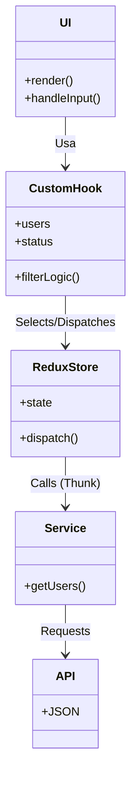

# Diagramas del Proyecto

## Diagrama de Flujo (Mermaid)

```mermaid
graph TD
    A[Inicio App] --> B{¿Datos en Store?}
    B -- No --> C[Disparar fetchUsers]
    C --> D[Servicio API]
    D --> E{¿Respuesta OK?}
    E -- Sí --> F[Actualizar Store (Success)]
    E -- No --> G[Actualizar Store (Error)]
    F --> H[Renderizar Lista]
    G --> I[Renderizar Error]
    B -- Sí --> H
    H --> J[Usuario Filtra]
    J --> K[useMemo Filtra Datos]
    K --> L[Actualizar UI]
```

## Diagrama de Arquitectura


