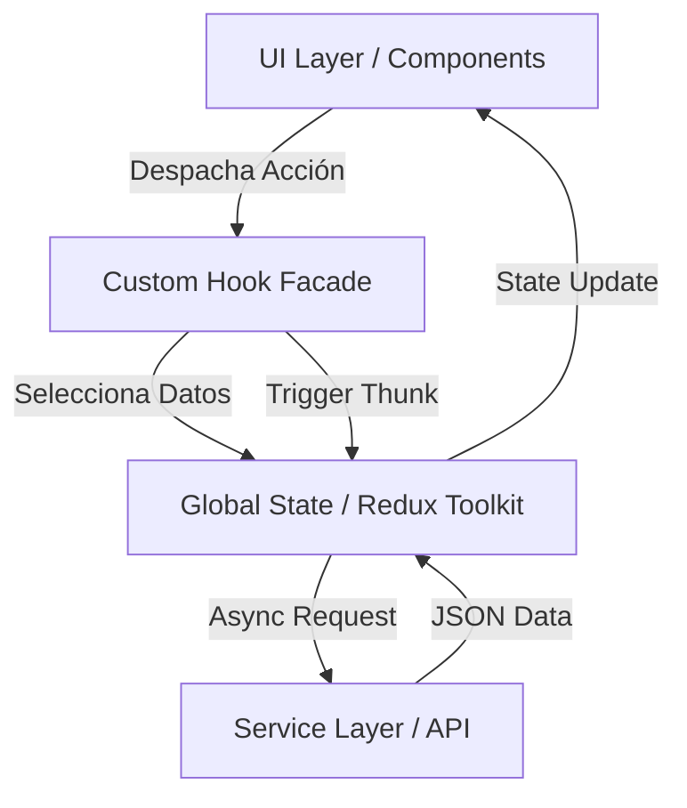

# Arquitectura y Diseño del Sistema

## 1. Visión General de la Arquitectura

Este proyecto sigue una **Feature-Based Architecture (Arquitectura Basada en Funcionalidades)**, diseñada para maximizar la escalabilidad y el desacoplamiento. A diferencia de las estructuras tradicionales organizadas por "tipo técnico" (components, hooks, services), aquí la unidad organizativa principal es la **Feature** (Funcionalidad de Negocio).

### Diagrama de Alto Nivel

---

## 2. Patrones de Diseño Aplicados

### 2.1 Feature-Based Architecture

**Ubicación:** `src/features/`
Cada funcionalidad principal del negocio (en este caso, `users`) reside en su propio directorio dentro de `features`. Este directorio encapsula:

- **Componentes de Página:** (`UsersPage.jsx`) El punto de entrada de la feature.
- **Componentes Específicos:** (`components/UserList`) UI que solo tiene sentido en este contexto.
- **Gestión de Estado:** (`usersSlice.js`) La lógica de Redux específica para este dominio.

**Ventaja:** Permite que la aplicación crezca horizontalmente. Si necesitamos una feature de "Productos", creamos `src/features/products` sin ensuciar el resto de la app.

### 2.2 Patrón Facade (Custom Hook)

**Implementación:** `src/hooks/useUsers.js`
Actúa como una fachada entre la UI y la lógica de estado.

- **Responsabilidad:** Los componentes visuales no saben (ni deben saber) si usamos Redux, Context API o Zustand. Solo consumen datos y funciones de este hook.
- **Beneficio:** Si mañana cambiamos Redux por React Query, solo modificamos el hook, no los componentes.

### 2.3 Service Layer Pattern (Capa de Servicios)

**Ubicación:** `src/services/`
Toda la comunicación externa (API REST) está aislada aquí.

- **Regla:** Los componentes NUNCA hacen `fetch` directamente. Los Thunks de Redux tampoco deberían conocer los detalles de la implementación HTTP, solo llamar al servicio.
- **Implementación:** `users.service.js` maneja la llamada a `jsonplaceholder`.

### 2.4 Híbrido CSS: Utility-First + BEM

**Ubicación:** `src/index.css`
Se utiliza **Tailwind CSS** vía directiva `@apply` para construir clases semánticas siguiendo la convención **BEM (Block Element Modifier)**.

- Ejemplo: `.card__title` encapsula `@apply text-2xl font-semibold...`.
- **Objetivo:** Mantener el HTML/JSX limpio de la "sopa de clases" de Tailwind, centralizando el diseño en un archivo CSS mantenible.

---

## 3. Flujo de Datos (Data Flow)

El flujo es **Unidireccional (One-Way Data Flow)** estricto:

1.  **Evento:** Usuario escribe en `SearchBar`.
2.  **Action:** `useUsers` despacha una acción o actualiza un estado local.
3.  **State Change:** Redux actualiza el store (o React actualiza el state local del hook).
4.  **Render:** La UI se suscribe a los cambios y se repinta automáticamente.

### Gestión de Estado Asíncrono

Para las peticiones a la API, se utiliza **Redux Thunk** (`createAsyncThunk`):

- Estados manejados explícitamente: `idle` -> `loading` -> `succeeded` | `failed`.
- Esto previene condiciones de carrera y asegura una UI consistente (Skeleton loaders, mensajes de error).

---

## 4. Decisiones Técnicas Clave

| Decisión    | Tecnología                        | Justificación                                                                  |
| :---------- | :-------------------------------- | :----------------------------------------------------------------------------- |
| **Bundler** | Vite                              | Velocidad de desarrollo (DX) superior a Webpack/CRA.                           |
| **State**   | Redux Toolkit                     | Estándar de industria, facilita debug con DevTools y slices reducibles.        |
| **CSS**     | Tailwind + CSS Modules (Simulado) | Velocidad de Tailwind con la limpieza de BEM.                                  |
| **Routing** | _Sin Router_                      | Para el alcance actual (Single View), un Router añade complejidad innecesaria. |
